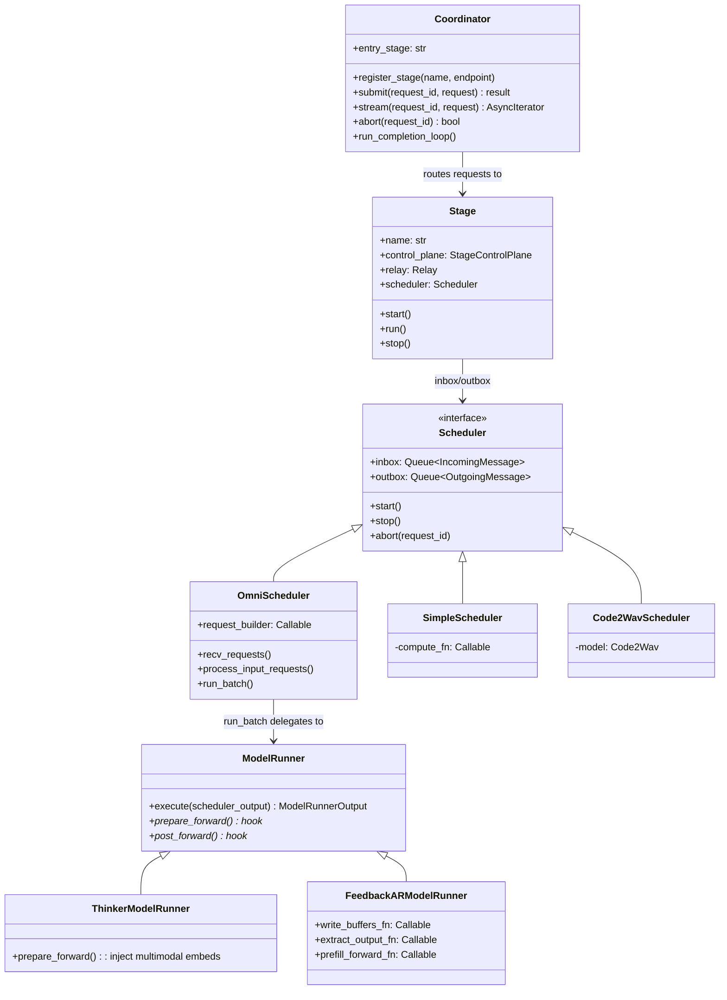
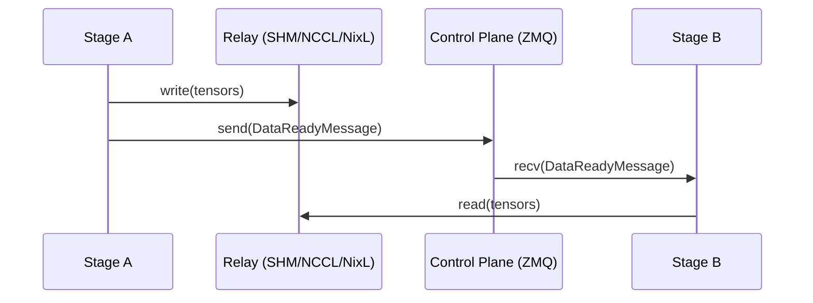
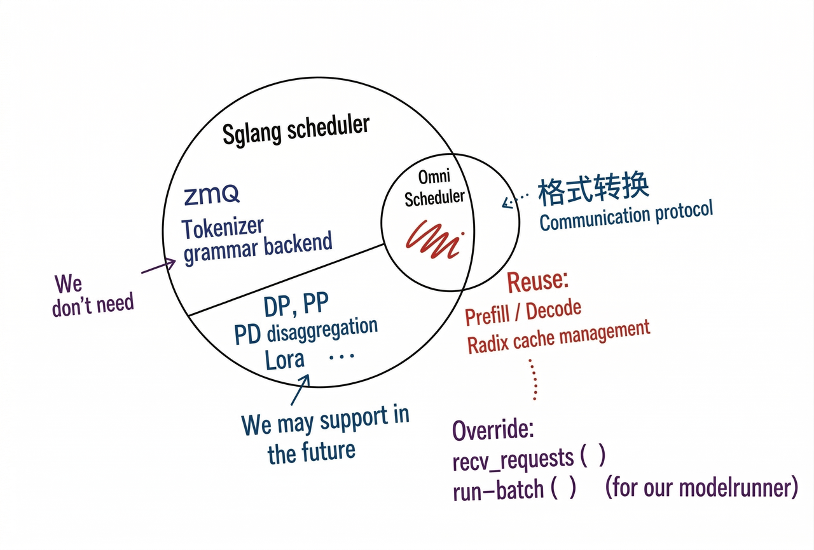
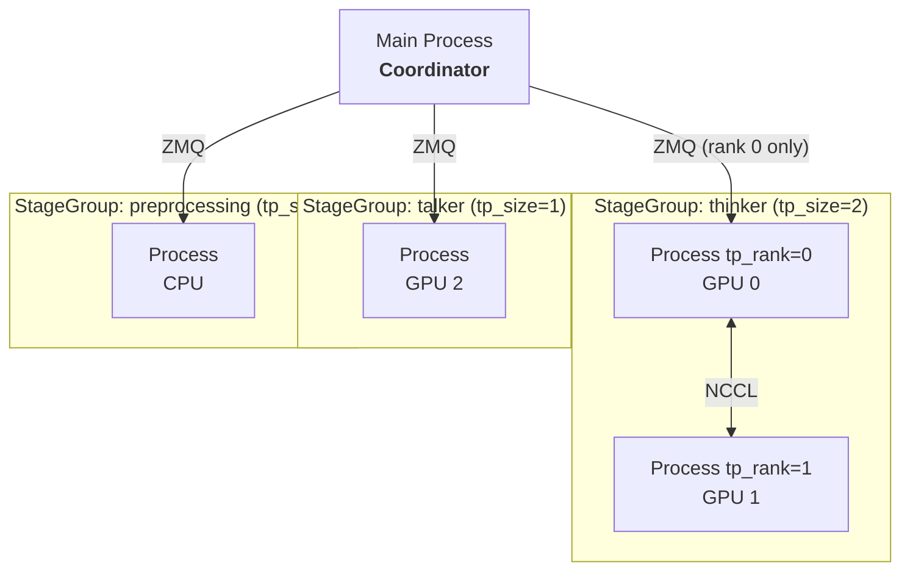
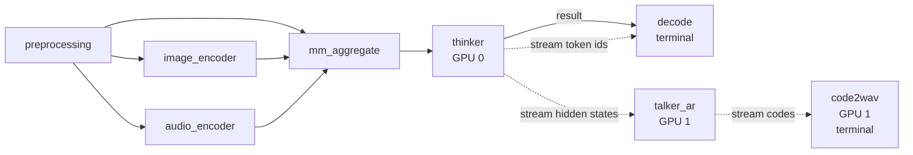
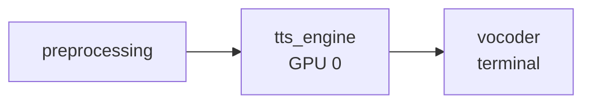
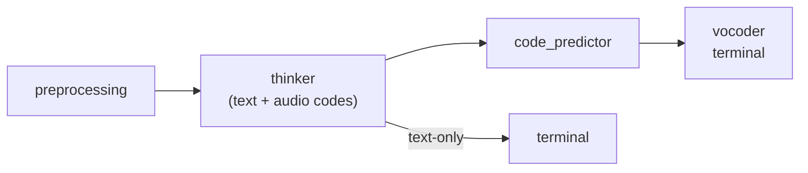
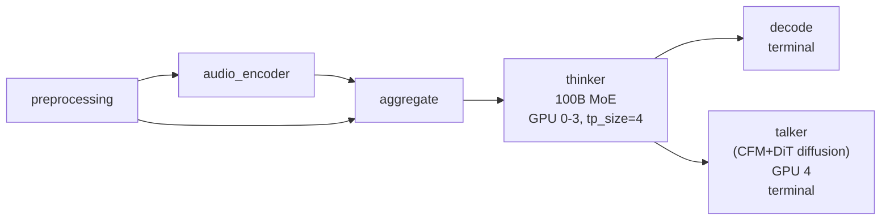

# SGLang Omni Refactor Tracking

---

Follows from [sglang#16546](https://github.com/sgl-project/sglang/issues/16546). Addresses problems in [#188](https://github.com/sgl-project/sglang-omni/issues/188).

## Architecture

### System Overview

```
HTTP API → Client → Coordinator → Stage → [Scheduler → ModelRunner → forward]
```

### Layer Responsibilities

| Layer           | Responsibility                                                                     | Model-aware? |
| --------------- | ---------------------------------------------------------------------------------- | ------------ |
| **Coordinator** | Request lifecycle, routing to entry stage, multi-terminal merge, abort broadcast   | No           |
| **Stage**       | IO shell — ZMQ control plane, relay data plane, fan-in aggregation, stream routing | No           |
| **Scheduler**   | Batch selection, KV cache management, compute dispatch                             | Partially    |
| **ModelRunner** | Forward pass, sampling, model-specific hooks                                       | Yes          |

### Directory Layout

```
sglang_omni/
├── pipeline/           # Inter-stage orchestration (model-agnostic)
├── scheduling/         # Scheduling loops (OmniScheduler, SimpleScheduler)
├── model_runner/       # Model runner base + shared FeedbackARModelRunner
├── models/             # Model definitions + pipeline configs
├── config/             # Pipeline config schema + compiler
├── relay/              # Data transfer backends (SHM, NCCL, NixL)
├── serve/              # HTTP server, OpenAI API
├── client/             # Client library
└── proto/              # Message types
```

### Class Diagram



> **Note (Chenyang):** HTTP API → Client is currently lost from the original lifecycle diagram and should be added back to the system overview. @Huapeng

> **Note (Chenyang):** Please add the WebSocket here. @huapeng

> **Note (Yichi):** nit: ModelRunner hook can be illustrated more clearly in the overview (e.g. by splitting into prepare_prefill/decode and post_prefill/decode rather than generic prepare/post_forward). Since they have different behavior on thinker and talker, and it is important enough to demonstrate in the graph.

> **Note (Yichi):** Also, "Client" section doesn't seem to be appear in the doc, should we add it as well?

> **【TODO: Huapeng make up https design layer】**

---

## Pipeline Layer

### HTTP/Websocket

HTTP and websocket is sglang omni's request endpoint which exposes to the outside, as user we can get the response we want via these endpoint.

- **HTTP:**
  - `POST /v1/chat/completions`
  - `POST /v1/audio/speech`
  - `GET /v1/models`
  - `GET /health`
- **WebSocket:**
  - `WS /v1/realtime`

For the difference between http and websocket, you can think it's like when you chat, you use messages or phone call, one is request and get, one is duplex communication. PR ref

### Client

Client is like the adapter between http/websocket and coordinator, it's like the real implementation of endpoint.

Like the `/speech`, it refines the input calls the generate and return the refined output.

Code part:

```python
async for chunk in self.generate(request, request_id=request_id):
    if chunk.audio_data is not None:
        audio_chunks.append(chunk.audio_data)
    if chunk.sample_rate is not None:
        sample_rate = chunk.sample_rate
    last_chunk = chunk
```

### Coordinator

Global request router. Tracks the request lifecycle across stages.

1. Routes new requests to the entry stage
2. Collects completions from terminal stages
3. Merges results when multiple terminal stages exist (e.g., `decode` + `code2wav`)
4. Broadcasts abort to all stages

### Stage

IO shell. Every stage has one scheduler (no branching). Handles all inter-stage communication.

```python
class Stage:
    def __init__(self, name, control_plane, relay, route_fn,
                 input_handler, scheduler, stream_targets, same_gpu_targets):
        self.scheduler = scheduler  # always present
```

Responsibilities:

- **Control plane (ZMQ):** receive `SubmitMessage`, `DataReadyMessage`, `AbortMessage`
- **Data plane (Relay):** read/write tensors between stages via SHM/NCCL/NixL
- **Input aggregation:** wait for multiple upstream stages before dispatching (`AggregatedInput`)
- **Stream routing:** receive/send streaming chunks (hidden states, codec codes)
- **Dispatch:** push all messages into `scheduler.inbox`, drain `scheduler.outbox`

One code path. Stage never checks scheduler type.

### Inter-Stage Communication



- **Control plane (ZMQ):** small messages — Submit, DataReady, Abort, Shutdown. PUB/SUB for abort broadcast, PUSH/PULL for point-to-point.
- **Data plane (Relay):** large tensors. Pluggable backends: SHM (single machine), NCCL (multi-GPU), NixL (RDMA multi-node), Mooncake. Same-GPU stages use CUDA IPC zero-copy automatically.
- **Streaming:** hidden states / codec codes flow via `DataReadyMessage` with `chunk_id` and `is_done` fields, parallel to normal result routing.

The split between control and data planes is the core architectural decision: ZMQ stays out of the tensor path, the relay stays out of the coordination path, and either can be swapped independently.

#### Why not Ray?

The thinker→talker relationship is fundamentally producer–consumer: thinker produces hidden states / text tokens, talker consumes them and emits audio codes. Structurally this is the same pattern as RL training (actor produces trajectories, learner consumes them), where Ray is the dominant orchestration layer. So it is a fair first-principles question whether we should use Ray for inter-stage scheduling instead of hand-rolling ZMQ + relay.

We chose not to. Ray's overhead — extra runtime, object-store semantics, and operational footprint — is significant for our shape: a small fixed number of stages on a small fixed number of GPUs, with no autoscaling. ZMQ + relay covers the topology with much less moving infrastructure. The decision is revisitable; nothing in the pipeline layer hard-bakes "no Ray" beyond the relay backend list.

### `relay_io` Utility Module

Utility module providing:

- **User-facing API**
  - `write_payload` / `read_payload` — full `StagePayload` serialization via relay
  - `send_stream_chunk` — handles same-GPU IPC vs cross-GPU relay, NIXL credit deadlock avoidance
- **Internal-facing API**
  - `write_blob` / `read_blob` — raw tensor transfer for streaming chunks
  - `extract_tensors` / `restore_tensors` — recursive tensor extraction from nested dicts

**API layering.** Stages only call the user-facing API. `write_blob` / `read_blob` get wrapped by `send_stream_chunk` for cross-GPU transfer; `extract_tensors` / `restore_tensors` get used inside `write_payload` / `read_payload` to pull tensors out of nested dicts. The internal layer exists so the user-facing surface stays small.

**Asymmetric stream API — no `recv_stream_chunk`.** Only `send_stream_chunk` exists because the sender has real decisions to make (same-GPU IPC vs cross-GPU relay, NIXL credit management), while the receiver just calls `read_blob` from the stage's main message loop. Wrapping a one-liner into `recv_stream_chunk` would add a layer without adding any value.

---

## Scheduling Layer

All schedulers share the same interface: `inbox`, `outbox`, `start()`, `stop()`, `abort()`.

### OmniScheduler — Composition with SGLang



For AR stages. Subset of SGLang Scheduler — reuses `get_next_batch_to_run()`, `run_batch()`, `process_batch_result()`, `event_loop_normal()`, overlap scheduling.

- **Reused from SGLang:** `get_next_batch_to_run()`, `process_batch_result()`, `self_check_during_idle()` — KV cache management, prefill/decode scheduling, tree cache, dLLM support
- **Overridden:** `init` (skip ZMQ/tokenizer/metrics), `recv_requests()` (drain inbox, route stream chunks to per-request state), `process_input_requests()` (`request_builder` conversion), `run_batch()` (delegate to ModelRunner), `send_to_tokenizer()` (no-op)
- **Not used from SGLang:** ZMQ channels, tokenizer init, grammar backend, metrics exporter, disaggregation, LoRA, speculative decoding, PP, watchdog

Runs in a dedicated thread. Stage communicates via thread-safe queues.

#### Composition boundary with SGLang

Composing on top of SGLang's `Scheduler` is the right call, but only if we pin the boundary deliberately — RL forks of SGLang have hit upgrade pain by letting composition drift into a de facto fork. Three rules govern the boundary:

1. **Pin, don't track.** Tracking SGLang `main` fits the same-umbrella relationship, but only if CI runs against the real Scheduler rather than mocks. Running that CI is currently too expensive, so we pin.
2. **Minimize reuse surface.** Treat `PrefillManager` and `DecodeManager` as black boxes — public methods only, no reads or writes of internal attributes. The moment we touch internals, composition becomes a fork.
3. **Upstream-first, when affordable.** If OmniScheduler needs something SGLang doesn't cleanly expose, the preferred fix is a hook or factored-out method in SGLang `main` rather than a downstream patch. Today the cost of upstream PRs is high enough that we don't routinely do this; it remains the long-term direction.

> **Note (Chenyang):** Should we separately discuss `ThinkerScheduler` and `CodePredictorScheduler`? Their KV cache is quite different. `CodePredictor` is put under Talker.

### Error handling

Previously the same OOM produced different externally-visible behaviors across models: S2-Pro and Voxtral returned HTTP 500 (correct), Ming-Omni returned HTTP 200 with `waveform=None` (silent failure), Qwen3-Omni returned HTTP 200 with a zero tensor (looks like a valid waveform downstream). The first two were correct only because they did nothing; the latter two failed because broad `except Exception` blocks in the executor swallowed the error. The fix lives at the Scheduler layer (#449):

1. **Unified catch in `run_batch()`** — Scheduler wraps forward, catches exceptions, marks the request failed, propagates via outbox → Coordinator → HTTP 500 for non-streaming. For streaming responses HTTP headers are already flushed before the first chunk, so HTTP 500 cannot fire mid-stream — successful streams terminate with an explicit completion sentinel frame, and failed streams abort the connection before emitting it. Absent sentinel + premature close is the client-side failure signal.
2. **Model executors forbidden from writing `except Exception`** — model-side code is pure functional and exceptions propagate naturally. Specific expected exceptions must catch specific types, never base `Exception`. Enforced via lint rule, not review discipline: rule 1's catch is path-local to `run_batch()`, so a broad catch in `add_request` or embed-load paths slips past it.
3. **Fallbacks architecturally disallowed** — executor either succeeds or hands off to Scheduler. No third path returning a "fake success" indistinguishable from a real result.
4. **CI fault injection** — inject OOM and verify the correct failure signal per model: HTTP 500 for non-streaming, sentinel-absent + premature close for streaming. Detection complements but does not substitute for rule 2's lint enforcement.

The short-term bridge fix (#302) landed without an `is_oom_error()` helper, since that helper would become dead code once the Scheduler-layer catch lands.

> **【TODO: chenyang, I pinged my comment in#449】**

### SimpleScheduler

For non-AR stages (preprocessing, encoders, aggregate, decode). No KV cache, no batching. Just `inbox.get()` → `fn(data)` → `outbox.put()`. Supports inbox/outbox and basic forward operation; batched processing supported where useful.

### Code2WavScheduler

Streaming vocoder. Handles:

- `new_request` → init
- `stream_chunk` → accumulate + decode
- `stream_done` → flush + output

### Message Types

```python
class IncomingMessage:
    request_id: str
    type: "new_request" | "stream_chunk" | "stream_done"
    data: Any

class OutgoingMessage:
    request_id: str
    type: "result" | "stream"
    data: Any
    target: str | None  # for stream: downstream stage name
```

---

## Model Runner + Callbacks

```
ForwardBatch → prepare_forward() → forward() → post_forward() → sample() → ModelRunnerOutput
                    ↑ hook                          ↑ hook
```

| Runner                    | Used by                | Hook behavior                                                        |
| ------------------------- | ---------------------- | -------------------------------------------------------------------- |
| **ThinkerModelRunner**    | Qwen3 / Ming thinker   | prepare_forward: inject multimodal embeddings                        |
| **FeedbackARModelRunner** | Qwen3 talker, Fish TTS | 3 callbacks: write_buffers_fn, extract_output_fn, prefill_forward_fn |

CUDA Graph and `torch.compile` are class-shareable rather than configured model by model — the ModelRunner abstraction exists in part to make this the default; special models can still override.

DiffusionModelRunner is no longer speculative — Ming-Omni (#236) requires it, and image-gen diffusion is functionally working. It should be added as a first-class runner type alongside `ThinkerModelRunner` and `FeedbackARModelRunner` later.

### `ModelRunner` (Base)

Shared execute pipeline for all AR models.

```python
class ModelRunner:
    def execute(self, scheduler_output):
        forward_batch = ForwardBatch.init_new(...)
        batch_result = self.prepare_forward(...)  # hook
        if batch_result is None:
            batch_result = self.tp_worker.forward_batch_generation(forward_batch)
        self.post_forward(batch_result, ...)       # hook
        # sample, logit processing, output extraction
        return ModelRunnerOutput(...)
```

Shared: `ForwardBatch` construction, sampling, repetition penalty, codec suppression, output processing.

> **Note (Chenyang):** The earlier `prepare_forward` / `if batch_result is None` block was misleading — `prepare_forward` was doing two unrelated things (mutating the batch and short-circuiting to a custom forward result). The version above splits those into `before_forward` (always mutates in place) and an explicit `custom_forward` branch, which makes the prefill-with-injection path (Fish TTS) honest instead of disguising it as "the hook returned a value." My suggestions are:

```python
def execute(self, scheduler_output):
    forward_batch = ForwardBatch.init_new(...)

    # Mutate forward_batch in place (e.g. inject multimodal embeds).
    self.before_forward(forward_batch, ...)

    # Two mutually exclusive paths:
    #   - custom_forward: model-specific forward (e.g. Fish TTS prefill
    #     with VQ embedding injection).
    #   - default forward: standard tp_worker.forward_batch_generation.
    if self.has_custom_forward:
        forward_output = self.custom_forward(forward_batch, ...)
    else:
        forward_output = self.tp_worker.forward_batch_generation(forward_batch)

    self.post_forward(forward_output, ...)
    return ModelRunnerOutput(...)
```

> **【TODO: Jingwen, have we done this part】**

### `ThinkerModelRunner`

Injects multimodal embeddings (image / video / audio) + deepstack before forward.

```python
class ThinkerModelRunner(ModelRunner):
    def prepare_forward(self, ...):
        # Inject multimodal embeds into forward_batch
        ...
```

### `FeedbackARModelRunner`

Shared model runner for all AR + codebook models (Qwen3 talker, Fish TTS, future models) whose feedback loop is **self-contained within a single ModelRunner instance** — both the feedback producer and the receiver live inside one decode step. Cross-stage feedback (producer and receiver in separate schedulers, communicating via relay) is out of scope for this abstraction and would need a different design; today nothing requires it, but stating the boundary up front prevents future contributors from bending the abstraction to cover topologies it was not designed for.

The model's `forward()` handles backbone + secondary head internally. This runner writes / reads model buffers around forward.

```python
class FeedbackARModelRunner(ModelRunner):
    def __init__(self, tp_worker, output_processor, outbox, *,
                 write_buffers_fn, extract_output_fn, prefill_forward_fn=None):
        ...

    def prepare_forward(self, ...):
        if decode:
            self._write_buffers(model, schedule_batch, requests)
        elif prefill and self._prefill_forward:
            return self._prefill_forward(tp_worker, forward_batch, ...)
        return None

    def post_forward(self, ...):
        self._extract_output(model, schedule_batch, requests, outbox)
```

Model-specific behavior via three callbacks:

- `write_buffers_fn`: write previous step's feedback into model buffers
- `extract_output_fn`: read codes / feedback from model after forward
- `prefill_forward_fn`: custom forward for prefill (optional)

#### Callback pattern: bare functions vs Strategy object

Each model currently provides three bare functions that get passed in individually. This works, but the three are semantically coupled — they all operate on the same model's buffers — and nothing at the type level enforces that coupling.

A lightweight improvement is to collect them into a Strategy object:

```python
class FeedbackStrategy(Protocol):
    def write_buffers(self, model, schedule_batch, requests) -> None: ...
    def extract_output(self, model, schedule_batch, requests, outbox) -> None: ...
    def prefill_forward(self, tp_worker, forward_batch, ...) -> Optional[BatchResult]: ...

class QwenTalkerStrategy:
    def write_buffers(self, model, schedule_batch, requests):
        # feedback_embeds + trailing/pad → model._feedback_buffer
    def extract_output(self, model, schedule_batch, requests, outbox):
        # model._output_codes → outbox, _output_embeds → feedback
    def prefill_forward(self, tp_worker, forward_batch, ...):
        # projected input_embeds prefill

class FishTTSStrategy:
    def write_buffers(self, ...): ...
    def extract_output(self, ...): ...
    def prefill_forward(self, ...): ...
```

The bare-function form is what ships today; the Strategy form is the recommended evolution if a third self-contained model joins. The trade-off is mostly typing surface vs explicitness — neither blocks the other.

> **【TODO: Jingwen, have we done this part】**

### Callback Pattern

Each model provides a `callbacks.py` with three functions:

**Qwen3 Talker** — `models/qwen3_omni/callbacks.py`:

1. `write_talker_buffers`: `feedback_embeds` + trailing/pad → `model._feedback_buffer`
2. `extract_talker_output`: `model._output_codes` → outbox, `_output_embeds` → feedback
3. `talker_prefill_forward`: projected `input_embeds` prefill

**Fish TTS** — `models/fishaudio_s2_pro/callbacks.py`:

1. `write_fish_buffers`: codebook values → `model._vq_codes`
2. `extract_fish_output`: `model._output_codes` → per-request output
3. `fish_prefill_forward`: VQ embedding injection into `input_embeds`

Adding a third model = write a new `callbacks.py` with three functions.

### Model.forward(): One Decode Step (AR + Codebook)

Both Qwen3 talker and Fish TTS follow the same internal pattern:

1. Read previous step's feedback from model buffers (written by `FeedbackARModelRunner`)
2. AR backbone → hidden states → logits
3. Sample first code from logits
4. Secondary head predicts remaining codebook layers autoregressively
5. Store combined output → buffers for next step
6. Output: multi-layer codes + feedback

The model class handles steps 1–6 inside `forward()`. `FeedbackARModelRunner` handles writing (before) and reading (after).

---

## Model Directory Convention

Every model follows the same file structure:

```
models/<model_name>/
├── config.py              — Pipeline config (stage definitions, GPU placement)
├── stages.py              — Stage factories (returns callable or OmniScheduler)
├── routing.py             — Stage routing functions (which stage follows which)
├── request_builders.py    — Inter-stage data transform (build engine requests)
├── payload_types.py       — Model-specific pipeline state
├── callbacks.py           — FeedbackARModelRunner callbacks
├── __init__.py
└── components/            — Model-specific torch modules, preprocessors, encoders
```

`routing.py` and `request_builders.py` are kept separate because they answer different questions: `routing.py` decides *which* stage runs next (topology, often deterministic), while `request_builders.py` formats data for models that need special input shapes — e.g. the Qwen3-Omni thinker → talker request transform. Localizing the model-specific format logic in `request_builders.py` keeps `routing.py` thin and framework-shaped.

### Qwen3-Omni

```
models/qwen3_omni/
├── config.py              — 8-stage speech, 6-stage text
├── stages.py              — 8 factories
├── routing.py             — 8 routing functions
├── request_builders.py    — build thinker/talker/encoder requests
├── payload_types.py       — PipelineState, OmniEvent, ThinkerOutput
├── callbacks.py           — write_talker_buffers, extract_talker_output, talker_prefill_forward
├── hf_config.py           — HF config classes
├── merge.py               — Merge 3 encoder outputs for thinker
├── components/
│   ├── thinker.py         — Model loader/wrapper (Qwen3OmniSplitThinker)
│   ├── thinker_model.py   — SGLang thinker model definition
│   ├── talker.py          — SGLang talker model (fused MTP)
│   ├── preprocessor.py    — Tokenize, load media, apply HF processor
│   ├── image_encoder.py   — Image tower
│   ├── audio_encoder.py   — Audio tower
│   ├── talker_input.py    — Build talker prefill
│   ├── streaming_detokenizer.py — Streaming text detokenizer scheduler
│   ├── code2wav_scheduler.py — Vocoder streaming scheduler
│   └── common.py          — Shared helpers
```

Speech pipeline (8 stages): `preprocessing → image_encoder → audio_encoder → aggregate → thinker → decode → talker → code2wav`. The `image_encoder` and `audio_encoder` stages run in parallel — the arrow above is for layout, not sequencing — and the design leaves room for offloading either tower to CPU.

The "tower" terminology for image/audio encoders follows the official Qwen3-Omni names; we keep that vocabulary here rather than introducing a divergent local one.

> **Note (Chenyang):** `PipelineState` and `OmniEvent` are ambiguous names — both sound like they belong to the framework, but they're model-specific. Rename later. **【TODO: Jingwen, have we done this part】**

### Fish Audio S2-Pro

```
models/fishaudio_s2_pro/
├── config.py              — 3-stage TTS
├── stages.py              — 3 factories
├── routing.py             — 3 routing functions
├── request_builders.py    — build_sglang_tts_request, apply_tts_result
├── payload_types.py       — S2ProState
├── callbacks.py           — write_fish_buffers, extract_fish_output, fish_prefill_forward
├── sglang_model.py        — SGLang model registration
├── tokenizer.py           — Tokenizer wrapper
└── fish_speech/           — Model definitions (text2semantic, DAC codec)
```

Pipeline (3 stages): `preprocessing → tts_engine → vocoder`

---

## Declarative Config

### Example

```python
stages = [
    StageConfig(name="preprocessing",
                factory="...create_preprocessing_executor",
                route_fn="...routing.preprocessing_next"),

    StageConfig(name="image_encoder",
                factory="...create_image_encoder_executor",
                gpu=0, next="mm_aggregate"),

    StageConfig(name="mm_aggregate",
                factory="...create_aggregate_executor",
                wait_for=["preprocessing", "image_encoder", "audio_encoder"],
                merge_fn="...merge_for_thinker",
                next="thinker"),

    StageConfig(name="thinker",
                factory="...create_thinker_executor",
                factory_args={"speech_enabled": True},
                gpu=0, next=["decode", "talker_ar"],
                stream_to=["talker_ar", "decode"]),

    StageConfig(name="decode", factory="...create_decode", terminal=True),

    StageConfig(name="code2wav", factory="...create_code2wav", gpu=1, terminal=True),
]
```

> **Note (Huapeng):** I feel realtime is needed supporting streaming in, an important feature for voice agent. https://vllm.ai/blog/streaming-realtime Do we need to consider more? We will do this in https://github.com/sgl-project/sglang-omni/pull/385

> **Note(Huapeng):** /realtime feature, for low latency voice agent and realtime transcription and translation, if we accept streaming input, it can get better results and be useful in daily usecase. I think sglang omni might need to implement this and implement features in openai's realtime interface, https://developers.openai.com/api/docs/guides/realtime This will unlock voice model's potential for real use case, like https://x.com/OpenAIDevs/status/2048871260512473385?s=20. For implement this, we get a streaming audio in, at the same time, the inference engine can receive the chunk and send the SSE back via websocket. We can reference some implementation in https://vllm.ai/blog/streaming-realtime and https://github.com/sgl-project/sglang/issues/22474#issuecomment-4241744895. Detailed plan is TBD.

Routing rule: exactly one of `next`, `route_fn`, or `terminal=True`. There is no "one thinker, multiple talkers" fan-out — talker decode requires the thinker's hidden state as prefix, so driving two independent talkers from the same prefix carries no useful semantics. Derived from stages: `entry_stage` (first stage), `terminal_stages`, `gpu_placement`, relay device.

### `StageConfig` reference

| Field        | Type             | Default    | Description                                                                        |
| ------------ | ---------------- | ---------- | ---------------------------------------------------------------------------------- |
| name         | str              | _required_ | Unique stage identifier                                                            |
| factory      | str              | _required_ | Dotted import path to factory function                                             |
| factory_args | dict             | {}         | Args forwarded to factory (model_path, gpu_id auto-injected)                       |
| next         | str \| list[str] | None       | Static routing: downstream stage(s). Replaces routing functions for most stages    |
| route_fn     | str              | None       | Dynamic routing: dotted path to fn(request_id, output) → str \| list[str] \| None  |
| terminal     | bool             | FALSE      | Terminal stage — no downstream. Coordinator collects the result here               |
| gpu          | int \| list[int] | None       | GPU id(s). None = CPU stage. List for TP (one GPU per rank)                        |
| tp_size      | int              | 1          | Tensor parallelism ranks. Must match len(gpu) if gpu is a list                     |
| wait_for     | list[str]        | None       | Fan-in: wait for these upstream stages before dispatching                          |
| merge_fn     | str              | None       | Dotted path to fn(dict[str, StagePayload]) -> StagePayload. Required with wait_for |
| stream_to    | list[str]        | []         | Stream hidden states / codes to these stages (parallel to normal routing)          |
| relay        | RelayConfig      | None       | Override relay settings. Auto-inferred from gpu if not set                         |

#### `route_fn` contract

`route_fn` has narrow utility: Qwen3-Omni and Fish S2 Pro are fully covered by `next` + `stream_to`. It is only needed when the hidden state itself carries a modality tag and the downstream branch must be decided from the data (e.g. Ming, where the output if/else's into a video or audio head). The contract is therefore narrow on purpose:

- Return value must be a stage already declared in `next`, so the topology stays statically derivable.
- Returning `None` is disallowed — drops belong in an explicit terminal sink, not hidden inside routing.
- The docstring restricts use to data-driven modality dispatch.

One field, narrow contract, easy to widen later when a real consumer shows up.

#### Runtime parameter plumbing

Critical runtime params (`mem_fraction_static`, `thinker_max_seq_len`, and soon `video_fps`) are today either hardcoded deep in the stack or routed through ad-hoc overrides that nobody fully understands. CLI, config-file, and override paths do not compose, and every new param reinvents its own precedence resolution.

The refactor should consolidate this into one canonical mechanism: a typed, stage-addressable override primitive at the `PipelineConfig` layer, with CLI / config / env as thin adapters on top. Every runtime param then flows through the same primitive. A related symmetry gap to fix at the same time: length validation guards only the thinker input side. Talker also needs an output-length cap so an unbounded decode loop (missed stop token, hallucination loop) cannot drive OOM or tail latency the same way. Both belong on the same plumbing once it exists.

#### Stage placement — same-GPU co-location

Stages may share GPUs. Earlier topologies hard-rejected same-GPU speech-stage placement, which left Talker on H200 at <2% utilization long-term. Informed by Ratish's vLLM-Omni investigation (vLLM co-locates thinker + talker on a single device via per-stage memory budgeting + NVML accounting), the placement model now treats "any stage on any GPU" as first-class, with budgeting that accounts for co-tenants rather than rejecting the topology.

Memory-fraction semantics have also been pinned down: vLLM's `gpu_memory_utilization` is a fraction of total VRAM, while SGLang's `mem_fraction_static` is a fraction of remaining VRAM after weights load — more principled for single-stage LLM, but ambiguous for omni where stages load sequentially and "remaining" depends on load order. The placement model now uses one explicit semantics rather than inheriting the ambiguity.

> **Note (Chenyang):** Should we merge `factory_args` and `factory` into one field?

### `PipelineConfig` reference

Derived (computed from stages, not set manually): `terminal_stages`, `gpu_placement`.

There is no compiler class. An earlier proposal threaded pipeline construction through a `compiler_pipeline()` entry point, but the multi-process path (`mp_runner._build_stage_groups`) re-implemented most of the same logic independently, with two near-duplicate `_resolve_factory_args` helpers. The compiler class was removed in #447 — pipeline construction now happens through a plain init function per model, which is sufficient given how few pipelines we maintain.

The `Pipeline` vs `Stages` distinction in code still needs to be sharper: both names appear in different places without a crisp mental model. This should be pinned down before the field set grows further.

---

## Multi-Process Runner

```
pipeline/
├── stage_process.py    # StageProcessSpec (picklable) + subprocess entrypoint
├── stage_group.py      # StageGroup — manages N processes per stage
└── mp_runner.py        # MultiProcessRunner — orchestrates all groups
```



> **Note (Chenyang):** `stage_group.py` and `stage_process.py` are tightly coupled — `StageGroup` is the only consumer of `StageProcessSpec`, the subprocess entrypoint is ~40 lines, and the spec is a small dataclass. None of the three justifies its own file. Merging into a single `stage_workers.py` keeps everything about "how a stage's processes get defined, spawned, and managed" in one place, and leaves `mp_runner.py` focused on cross-stage orchestration. Two files, cleaner ownership.

> **【TODO: Jingwen, have we merged these files】**

### `StageProcessSpec`

A fully-resolved, picklable dataclass built once in the main process. Subprocesses never re-compile the pipeline config — they just construct a `Stage` from the spec and run it.

> **Note (Chenyang):** "Spec" is too vague a class name. Rename to `StageLaunchConfig`.

The main process resolves all dotted strings, injects `model_path` / `gpu_id` into factory args, allocates ZMQ endpoints, and computes stream targets and relay config. The spec captures everything the child process needs.

The subprocess entrypoint (`stage_process_main`) is ~40 lines: import factory, call it, build routing callable from `route_fn` or `next_stages`, build input handler from `wait_for` / `merge_fn`, construct `Stage`, run.

#### Parallelism axes — TP today, extension path

`StageProcessSpec` exposes `tp_size` as a top-level field. This treats TP as a special axis, but it is only one of several plausible parallelism strategies — Qwen3-Omni's Thinker is MoE and could want EP, and throughput-oriented stages might want DP across replicas. If we add either later, we will accumulate `tp_size` / `ep_size` / `dp_size` at the top level.

The cleaner long-term shape is to group them under a single `parallelism: ParallelismConfig` field — `ParallelismConfig(tp=N)` reads as clearly as `tp_size=N` and leaves room to add `ep` and `dp` without further schema churn. We are intentionally not making that change now: with only TP in use, a `ParallelismConfig` would have exactly one attribute and add visual weight without adding capability. The intended migration is to introduce the group field at the same time as the second parallelism axis lands.

### `StageGroup`

Manages the lifecycle (spawn, `wait_ready`, shutdown, health monitoring) of all OS processes backing one logical stage. For `tp_size == 1` (default), one process. For `tp_size > 1`, spawns one process per TP rank with appropriate `tp_rank` / `gpu_id`.

### `MultiProcessRunner`

Orchestrates startup across all `StageGroup`s. `_build_stage_groups(config)` turns a `PipelineConfig` into `list[StageGroup]` by iterating over stages, resolving factory args, allocating endpoints, and building one `StageProcessSpec` per TP rank per stage. The Coordinator runs in the main process and only talks to rank 0 of each group.

### Tensor Parallelism Support

TP within a stage is orthogonal to pipeline parallelism between stages. The `StageGroup` spawns `tp_size` processes per AR stage. Each process runs a full `OmniScheduler` + `ModelWorker` with a different `tp_rank` and `gpu_id`. NCCL collectives inside the model forward keep TP ranks in lockstep. The Coordinator is TP-unaware — it only talks to rank 0 of each group.

Within a TP group, rank 0 receives from the control plane and broadcasts to peer ranks. All ranks make identical scheduling decisions. Only rank 0 sends results downstream. Each stage gets its own NCCL port (`_NcclPortAllocator` in `mp_runner.py`).

Declaring TP in a stage:

```python
StageConfig(name="thinker", factory="...", gpu=[0, 1, 2, 3], tp_size=4)
```

`StageGroup` spawns 4 processes. NCCL collectives inside the model forward keep them in lockstep. The coordinator only talks to rank 0. Each stage gets its own NCCL port.

---

## Supported Pipelines

### Qwen3-Omni (8-stage speech)



- `result`: from decode (terminal)
- `stream token ids`: thinker → decode
- `stream hidden states`: thinker → talker_ar
- `stream codes`: talker_ar → code2wav

Thinker streams hidden states to talker while simultaneously outputting text. Coordinator merges both terminals.

### Fish Audio S2-Pro (3-stage TTS)



### MiMo-Audio ([#249](https://github.com/sgl-project/sglang-omni/issues/249)) — planned



4-stage, single GPU. Thinker generates text + audio codes in one pass. No new abstractions needed.

### Ming-Omni ([#236](https://github.com/sgl-project/sglang-omni/issues/236)) — planned



---

## Adding a New Model

1. Create `models/<name>/config.py` — `PipelineConfig` subclass with stage definitions (routing, GPU placement, fan-in all inline via `next` / `wait_for` / `gpu`)
2. Create `models/<name>/stages.py` — factory per stage (return callable for `SimpleScheduler`, or `OmniScheduler` for AR)
3. Create `models/<name>/callbacks.py` — if AR + codebook: three functions for `FeedbackARModelRunner`
4. Create `models/<name>/components/` — model definitions, preprocessor, encoders
5. (Optional) Create `models/<name>/routing.py` — only if a stage needs dynamic routing (`route_fn`)

Everything else (`Stage`, `Coordinator`, `OmniScheduler`, `ModelRunner`, relay, compiler, mp_runner) is reused as-is.

---

## tp_size

---

## Progress Tracking

[PR #334](https://github.com/sgl-project/sglang-omni/pull/334) — V1 pipeline is still being debugged to pass all CIs.

Following the suggestion in [#188 (comment)](https://github.com/sgl-project/sglang-omni/issues/188#issuecomment-4161198732), we should also track how many files need to be touched and the upper bound of the cost of integrating a new model. Boson's upcoming model will serve as the first concrete data point.
